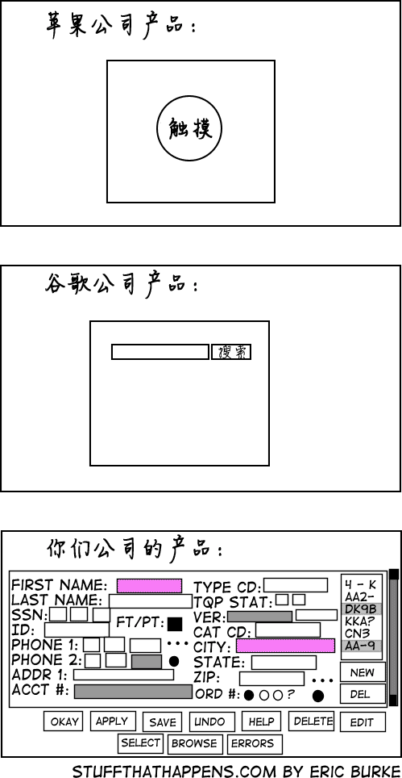
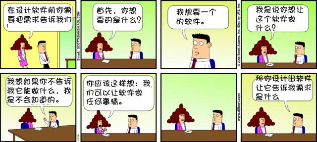
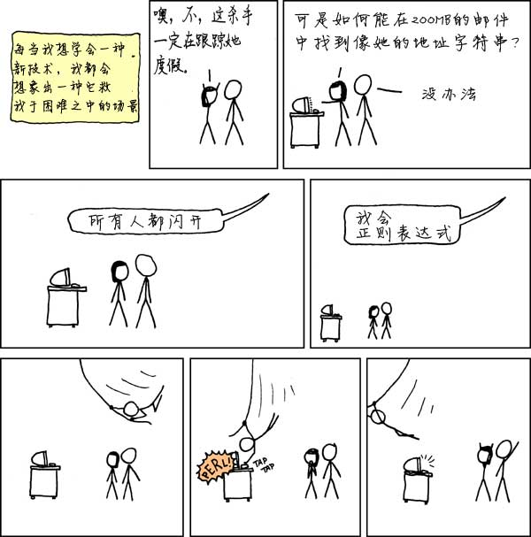
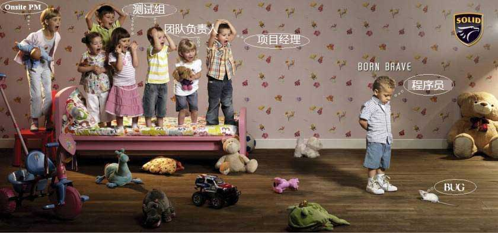
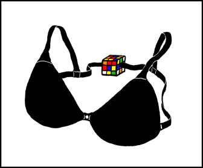
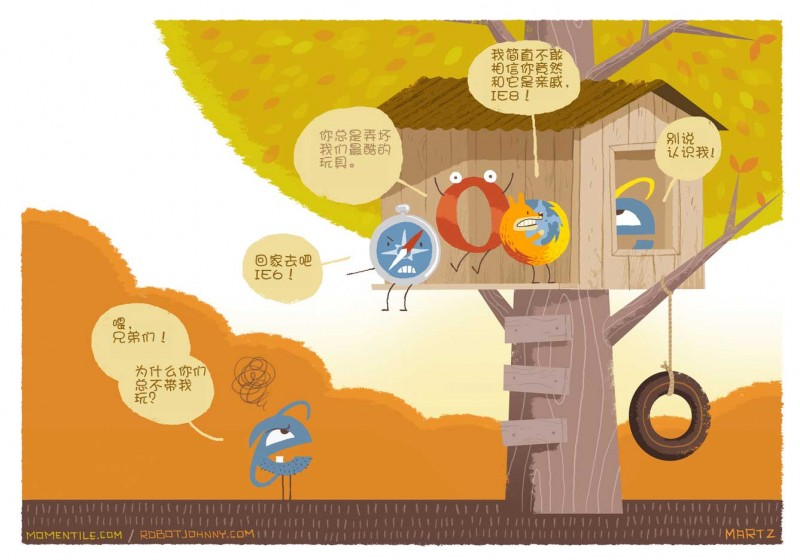
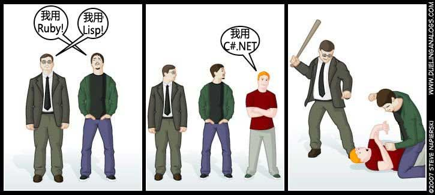
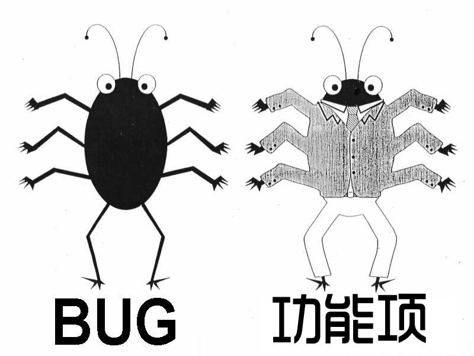
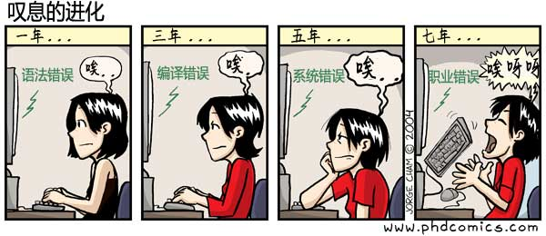

## 0. 计算机小天才

一个调皮的孩子在课堂上扔纸飞机，被老师抓到后罚在黑板上写500遍“我以后再也不在教室里扔纸飞机了(I will not throw paper airplanes in class.)”，于是这个小孩就在黑板上写了下面一段代码：

## 1. 你们公司的产品

> 嗨，谁授权把我们公司的产品界面贴在这里？

## 2. 需求调研

> 我遇到太多的客户都是这样！！！

## 3. 需求调研2

> 我把它打印出来挂在墙上，每当老板让我改东西时，我都让他看这个漫画。(我工作在一个真实的呆伯特的办公室里)

## 4. 正则表达式

> 我把它印在T恤上，有同事向我求助，他没看我的T恤，对着他的电脑屏幕说，“有谁会正则表达式？”，这是英雄的时刻。

## 5. 团队合作

> 这是我的桌面背景。

## 6. 沮丧

> 只有聪明的人能看出这个胸罩是前开的。

## 7. IE

## 8. C#.NET

> 作为一个C#程序员，我笑不出来。不是我在为C#辩护，只是为什么Ruby程序员和Lisp程序员要仇视C#？

## 9. 程序猿

> 他在为哪个公司干活？

## 10. 无间道

## 11. 叹息的进化

> 女怕嫁错郎，男怕入错行
